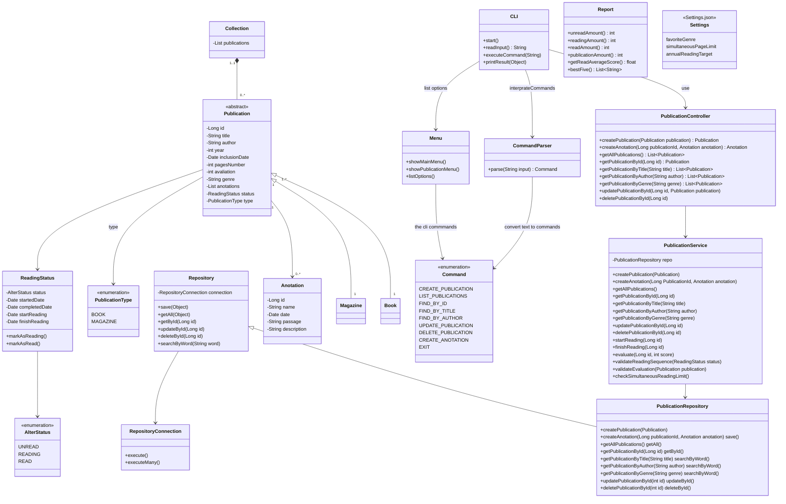

# biblioteca-pessoal-digital


# Objetivo:

Desenvolver um sistema de linha de comando (CLI), para gerenciar uma biblioteca pessoal de livros e revistas digitais, 
permitindo o cadastro de publicações, o registro de leituras, o controle de status (lido/ não lido/ em leitura) e a geração de relatórios sobre o acervo.
O sistema deve aplicar conceitos de encapsulamento, herança (simples e múltipla), métodos especiais, regras de negócio configuráveis.
A persistência pode ser feita em JSON ou SQLite, com um repositório desacoplado do domínio.


# Estrutura das Classes:



# Estrutura planejada de classes
```bash
.
├── main.py
├── program
│   ├── cli
│   │   ├── CLI.py
│   │   ├── ComandParser.py
│   │   ├── Comands.py
│   │   ├── Menu.py
│   │   └── window.txt
│   ├── controller
│   │   └── PublicationController.py
│   ├── domain
│   │   ├── AlterStatus.py
│   │   ├── Anotation.py
│   │   ├── Book.py
│   │   ├── Colletion.py
│   │   ├── Magazine.py
│   │   ├── Publication.py
│   │   ├── PublicationType.py
│   │   ├── ReadingStatus.py
│   │   └── Report.py
│   ├── repository
│   │   ├── RepositoryConnection.py
│   │   └── Repository.py
│   ├── service
│   │   └── PublicationService.py
│   └── settings.json
├── README.md
└── venv
```
